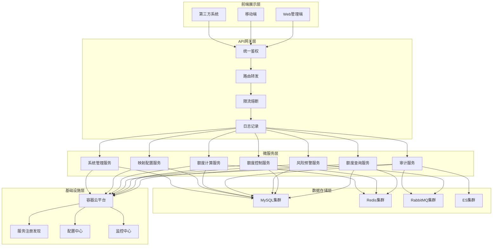
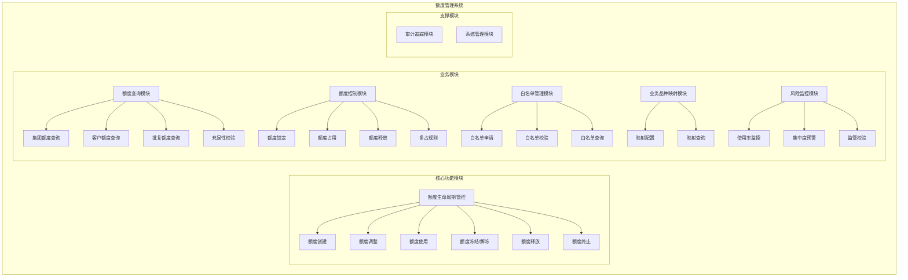
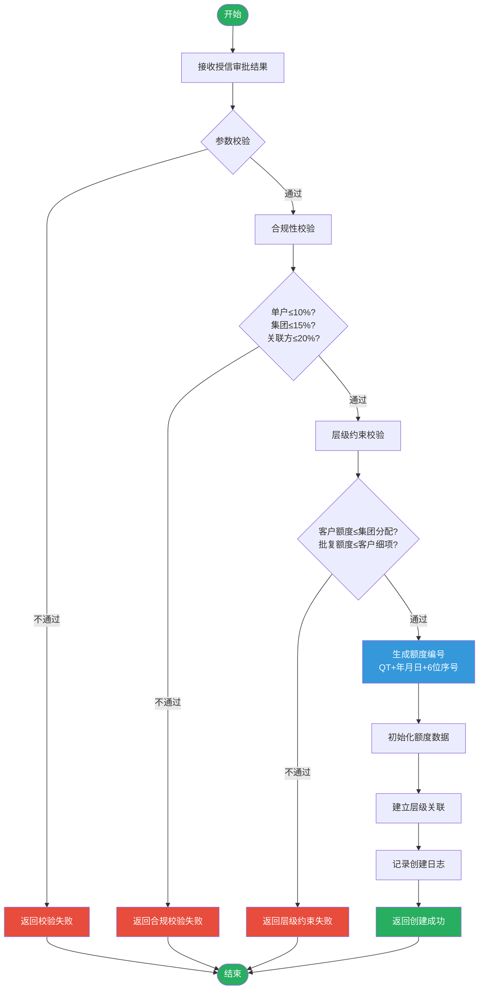
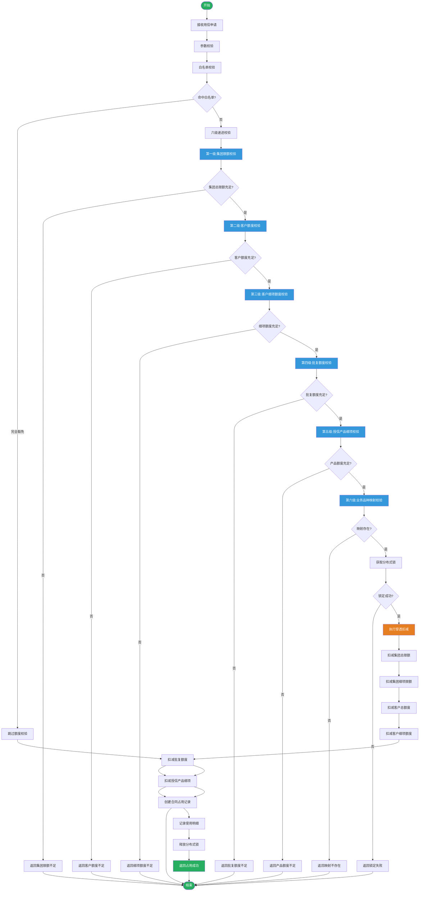
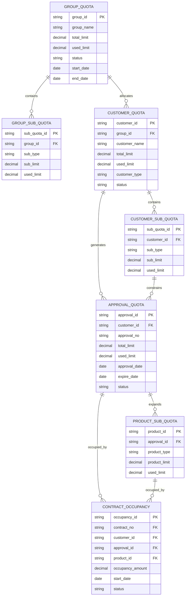
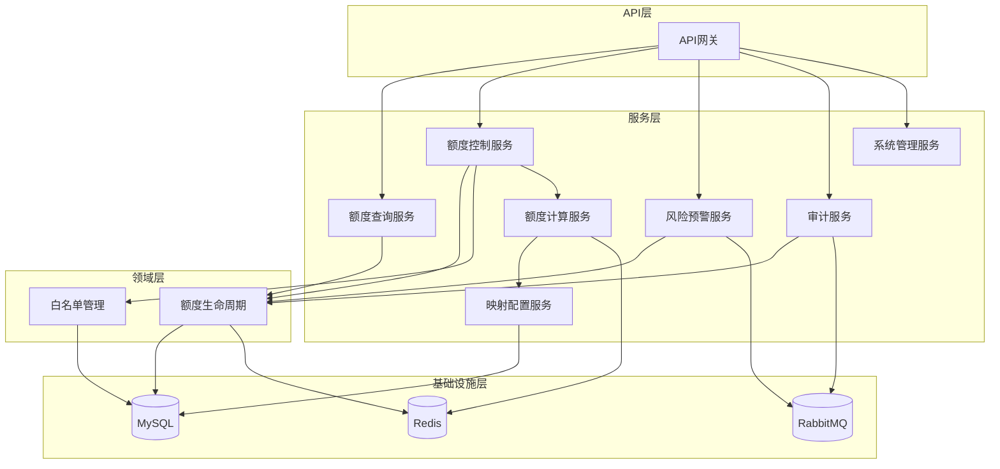
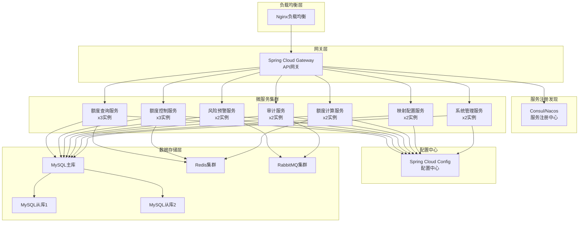
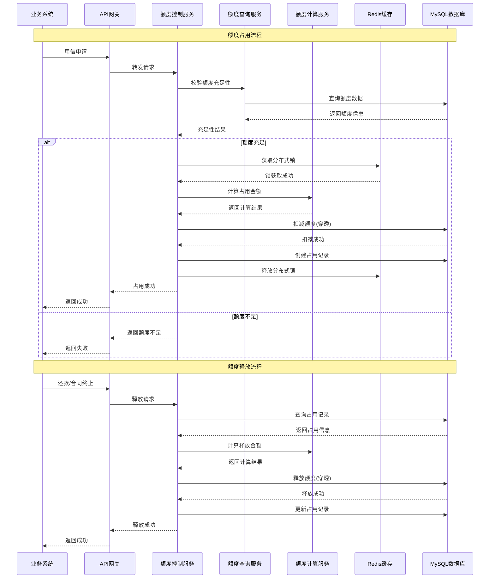
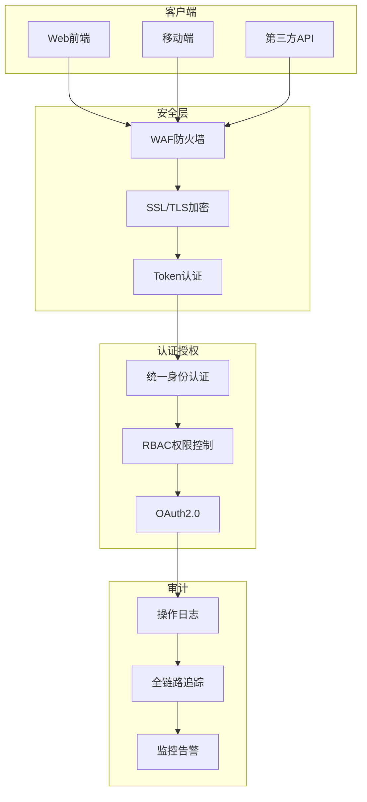
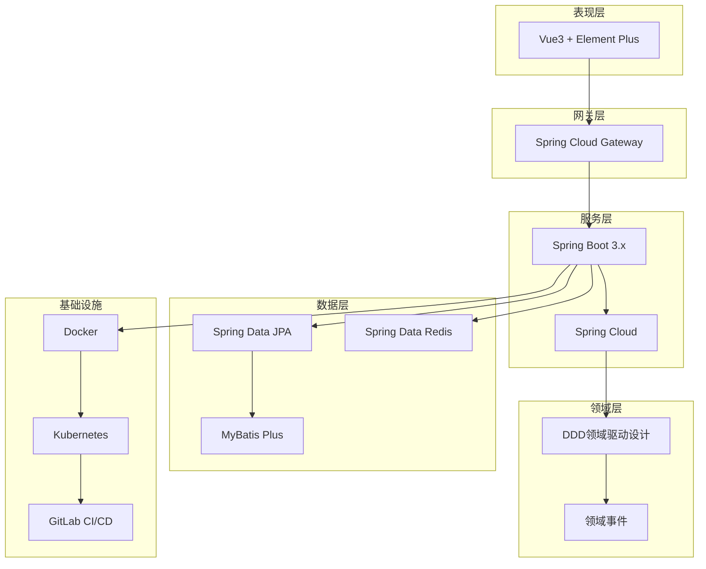

# 银行级信贷额度管控平台 - 设计图集

> 版本: V1.0 | 日期: 2026-02-25

---

## 1. 系统总体架构图



---

## 2. 六级额度管控体系架构

```mermaid
graph TD
    subgraph "第一层：集团总限额"
        G1[集团总限额<br/>Group Limit]
    end

    subgraph "第二层：集团细项限额"
        G2[敞口限额<br/>Exposure Limit]
        G3[低风险限额<br/>Low Risk Limit]
    end

    subgraph "第三层：客户额度"
        C1[对公客户额度<br/>Corporate Customer]
        C2[同业客户额度<br/>Interbank Customer]
    end

    subgraph "第四层：客户细项额度"
        C3[对公细项额度<br/>Corporate Sub-Limit]
        C4[R1-R4敞口额度]
        C5[R5低风险额度]
    end

    subgraph "第五层：批复额度"
        P1[授信批复额度<br/>Approval Limit]
    end

    subgraph "第六层：合同占用"
        O1[合同占用<br/>Contract Occupancy]

    G1 --> G2
    G1 --> G3
    G2 --> C1
    G2 --> C2
    G3 --> C2
    C1 --> C3
    C2 --> C4
    C2 --> C5
    C3 --> P1
    C4 --> P1
    C5 --> P1
    P1 --> O1

    style G1 fill:#e74c3c,color:#fff
    style G2 fill:#e67e22,color:#fff
    style G3 fill:#e67e22,color:#fff
    style C1 fill:#f39c12,color:#fff
    style C2 fill:#f39c12,color:#fff
    style C3 fill:#27ae60,color:#fff
    style C4 fill:#27ae60,color:#fff
    style C5 fill:#27ae60,color:#fff
    style P1 fill:#3498db,color:#fff
    style O1 fill:#9b59b6,color:#fff
```

---

## 3. 微服务模块划分图



---

## 4. 核心业务流程图 - 额度创建



---

## 5. 核心业务流程图 - 额度占用(六级穿透校验)



---

## 6. 数据库ER图 - 核心实体



---

## 7. 模块依赖关系图



---

## 8. 部署架构图



---

## 9. 数据流图 - 额度占用与释放



---

## 10. API接口关系图

```mermaid
graph LR
    subgraph "额度查询API"
        Q1[GET /quota/group/{id}<br/>集团额度查询]
        Q2[GET /quota/customer/{id}<br/>客户额度查询]
        Q3[GET /quota/approval/{id}<br/>批复额度查询]
        Q4[GET /quota/check<br/>额度充足性校验]
    end

    subgraph "额度控制API"
        C1[POST /quota/lock<br/>额度锁定]
        C2[POST /quota/occupy<br/>额度占用]
        C3[POST /quota/release<br/>额度释放]
        C4[POST /quota/freeze<br/>额度冻结]
        C5[POST /quota/unfreeze<br/>额度解冻]
    end

    subgraph "额度管理API"
        M1[POST /quota/create<br/>额度创建]
        M2[PUT /quota/adjust<br/>额度调整]
        M3[PUT /quota/terminate<br/>额度终止]
        M4[GET /quota/detail/{id}<br/>额度详情]
        M5[GET /quota/list<br/>额度列表]
    end

    subgraph "映射配置API"
        MP1[POST /mapping/product<br/>产品映射配置]
        MP2[GET /mapping/query/{bizType}<br/>映射查询]
    end

    subgraph "白名单API"
        W1[POST /whitelist/apply<br/>白名单申请]
        W2[GET /whitelist/check/{customerId}<br/>白名单校验]
    end

    Q1 & Q2 & Q3 & Q4 --> CTRL[额度控制服务]
    C1 & C2 & C3 & C4 & C5 --> CTRL
    M1 & M2 & M3 & M4 & M5 --> MGMT[额度管理服务]
    MP1 & MP2 --> MAPPING[映射配置服务]
    W1 & W2 --> WHITELIST[白名单服务]
```

---

## 11. 安全架构图



---

## 12. 技术架构总览



---

> 设计图说明：
> - 本设计图集基于《系统概要设计说明书》、《详细设计文档》、《数据库设计说明书》和《模块划分与接口设计文档》编制
> - 所有图表均采用Mermaid格式渲染，支持版本控制和协作编辑
> - 设计图涵盖：系统架构、额度层级、微服务模块、核心流程、数据库ER图、部署架构、数据流、API接口、安全架构等
